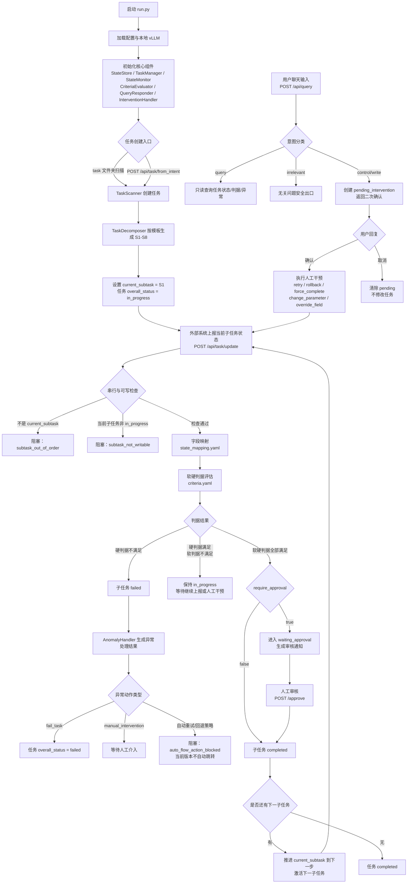

# SEAgent 2.0 开发交接简明文档

本文面向后续开发者，目标是在没有原开发者讲解的情况下，能够独立启动、理解和使用 SEAgent 2.0，并知道当前版本的关键边界和已知问题。

## 1. 系统定位

SEAgent 2.0 是一个面向 ROV 水下作业流程的任务监管系统。当前主要场景是“采油树控制面板插头插入任务”，系统把任务拆成 S1-S8 串行子任务，接收外部状态上报，按软硬判据评估每一步是否可推进，并通过对话接口支持查询、重试、回退、强制完成、参数修改和状态覆盖。

测试基线中，严格 HTTP 测试不是 FakeLLM 仿真，而是走真实服务：

- 后端状态输入：`POST /api/task/update`
- 任务创建：`POST /api/task/from_intent`
- 前端聊天输入：`POST /api/query`
- 状态查询：`GET /api/task/<task_id>/status`
- 人工审核通过：`POST /api/task/<task_id>/subtask/<sub_id>/approve`

## 2. 代码框架

核心入口：

- `run.py`：启动 Flask 服务，加载本地 vLLM/Tokenizer，初始化状态存储、判据评估器、任务管理器、异常处理器、干预处理器、查询响应器和任务扫描器。
- `src/server.py`：HTTP 路由层，负责接收任务创建、状态上报、人工审核和 `/api/query` 对话请求。
- `src/task_manager.py`：任务状态机协调层，负责创建任务、处理子任务状态上报、推进子任务、调用异常处理和异常建议。
- `src/state_monitor.py`：状态上报评估层，负责串行约束、字段映射、软硬判据评估，以及 `waiting_approval` 通知生成。
- `src/criteria_evaluator.py`：判据计算层，根据 `criteria.yaml` 判断硬判据、软判据是否满足。
- `src/anomaly_handler.py`：异常策略层，根据 `task_templates.yaml` 中的异常映射返回失败、人工介入或阻塞自动流程动作。
- `src/intervention_handler.py`：人工干预执行层，执行 `rollback`、`retry`、`force_complete`、`change_parameter`、`override_field`。
- `src/query_responder.py`：自然语言对话层，负责将用户输入分类为 `query/control/write/irrelevant`，生成确认文案和查询回答。

关键配置：

- `config/task_templates.yaml`：S1-S8 子任务模板、依赖关系、下一步、超时、重试次数和异常动作映射。
- `config/criteria.yaml`：每个子任务的硬判据、软判据、是否需要人工审核，以及判据解释。
- `config/state_mapping.yaml`：外部上报字段到内部判据字段的映射，例如 `distance_error_m -> distance_error_max`。
- `config/monitor.yaml`：服务端口、模型路径、持久化目录等运行配置。

状态数据默认落在 `data/tasks/*.json`。如果数据库组件可用，`run.py` 会尝试启用 JSON + DB 双写；不可用时回退到 JSON。

## 3. 核心逻辑设计

### 3.0 系统生命周期总图

### 3.1 任务生命周期

任务创建后会按模板生成 S1-S8：

1. S1 移动至采油树控制面板附近
2. S2 视觉识别插孔和插头的位置
3. S3 机械臂原点到夹取起点的路径规划
4. S4 夹取插头
5. S5 机械臂起点到插入终点的路径规划
6. S6 执行插入
7. S7 视觉 check 确认插入结果
8. S8 返程与复位

系统严格串行，只允许当前 `current_subtask` 接收状态上报。未来步骤或历史步骤的状态上报会被拒绝。

### 3.2 状态推进规则

外部系统通过 `/api/task/update` 上报当前子任务的 `criteria_details`。系统先通过 `state_mapping.yaml` 映射字段，再用 `criteria.yaml` 评估。

- 硬判据全部满足、软判据全部满足，且 `require_approval=true`：子任务进入 `waiting_approval`，等待人工审核。
- 审核接口 `/approve` 通过后：当前子任务标记完成，并推进到下一子任务。
- 硬判据不满足：子任务进入 `failed`，并调用异常处理逻辑。
- 硬判据满足但软判据不满足：子任务保持 `in_progress`，不会推进。

当前 S1-S8 都配置了 `require_approval: true`，因此即使判据全部满足，也需要人工审核后才会推进。

### 3.3 对话意图

`/api/query` 支持四类意图：

- `query`：只查询任务状态、进度、判据、异常、参数等，不改状态。
- `control`：改变流程位置或推进方式，包括 `retry`、`rollback`、`force_complete`。
- `write`：写入参数或覆盖状态，包括 `change_parameter`、`override_field`。
- `irrelevant`：与任务无关或系统不应处理的输入。

`control` 和 `write` 都需要二次确认。第一次请求只创建 `pending_intervention`；用户再次发送“确认”才会真正执行。发送“取消”会清除 pending。

## 4. 如何启动和使用

进入 2.0 目录：

```bash
cd /root/seagent/seagent2.0-main_nomodule
```

启动服务：

```bash
python run.py
```

默认服务端口来自 `config/monitor.yaml`，当前 README 中使用的是 `8889`。如果端口被占用，`run.py` 会尝试清理占用端口和 vLLM 相关进程。

创建任务有两种方式：

1. 把任务意图文件放入 `task/`，等待后台扫描器创建。
2. 直接调用 `/api/task/from_intent`。

示例：

```bash
curl --noproxy '*' -X POST http://localhost:8889/api/task/from_intent \
  -H "Content-Type: application/json" \
  -d @task/task_intent_TI2026021192.json
```

查询任务列表：

```bash
curl --noproxy '*' -s http://localhost:8889/api/tasks | jq .
```

查询单个任务状态：

```bash
curl --noproxy '*' -s http://localhost:8889/api/task/TI2026021192/status | jq .
```

## 5. 经典用例

### 用例 1：S1 正常上报并人工审核推进

上报 S1 达标状态：

```bash
curl --noproxy '*' -X POST http://localhost:8889/api/task/update \
  -H "Content-Type: application/json" \
  -d '{"task_id":"TI2026021192","type":"status_update","data":{"subtask_id":"S1","status":"reported","criteria_details":{"distance_error_m":0.05,"angle_error_deg":5.0,"speed_stable_frames":5,"grid_count":15,"panel_visible_flag":1,"plug_stable_flag":1},"anomaly_state":{"data_commun":"normal","perception":"normal","planning":"normal","execution":"normal","plant":"normal"}}}'
```

预期返回：

```json
{"action":"waiting_approval","subtask_id":"S1"}
```

人工审核通过：

```bash
curl --noproxy '*' -X POST http://localhost:8889/api/task/TI2026021192/subtask/S1/approve
```

预期结果：S1 完成，`current_subtask` 推进到 S2。

### 用例 2：S1 硬判据失败后人工重试

上报 S1 距离误差超标：

```bash
curl --noproxy '*' -X POST http://localhost:8889/api/task/update \
  -H "Content-Type: application/json" \
  -d '{"task_id":"TI2026021192","type":"status_update","data":{"subtask_id":"S1","status":"reported","criteria_details":{"distance_error_m":0.15,"angle_error_deg":5.0,"speed_stable_frames":5,"grid_count":15,"panel_visible_flag":1},"anomaly_state":{"data_commun":"normal","perception":"normal","planning":"normal","execution":"normal","plant":"normal"}}}'
```

预期结果：S1 失败，任务整体进入 `failed`。

通过对话发起重试：

```bash
curl --noproxy '*' -X POST http://localhost:8889/api/query \
  -H "Content-Type: application/json" \
  -d '{"task_id":"TI2026021192","global_mode":false,"message":"重试S1"}'
```

系统返回待确认动作后，再发送：

```bash
curl --noproxy '*' -X POST http://localhost:8889/api/query \
  -H "Content-Type: application/json" \
  -d '{"task_id":"TI2026021192","global_mode":false,"message":"确认"}'
```

预期结果：S1 状态恢复为 `in_progress`，任务整体恢复为 `in_progress`，之后可重新上报达标数据。

## 6. 允许的阻塞和约束处理

### 6.1 硬判据阻塞

硬判据是流程安全底线。只要任一硬判据不满足：

- 当前子任务会进入 `failed`。
- 根据异常映射返回 `fail_task`、`manual_intervention` 或 `auto_flow_action_blocked`。
- 对于 `fail_task`，任务整体会进入 `failed`。

示例：S1 的 `distance_error_max <= 0.1` 不满足时，会返回目标不可达类失败。

从失败恢复的合法方式：

- 对当前失败子任务重新上报满足判据的数据。
- 通过 `/api/query` 发起 `retry` 并确认。
- 通过 `/api/query` 发起 `rollback` 并确认。
- 通过 `/api/query` 发起 `force_complete` 并确认。
- 通过 `/api/query` 发起 `override_field` 或 `change_parameter` 并确认。

### 6.2 软判据阻塞

软判据不满足但硬判据满足时：

- 当前子任务保持 `in_progress`。
- 不会进入 `waiting_approval`。
- 不会自动推进。

这类阻塞不是任务失败，而是“数据质量或现场条件尚不足以进入审核”。需要继续上报更完整的状态，或由人工通过对话干预。

### 6.3 人工审核阻塞

当前 S1-S8 都要求人工审核。即使所有软硬判据满足：

- 子任务只会进入 `waiting_approval`。
- 必须调用 `/approve` 后才会进入下一步。

这是设计上的阻塞，用于保证关键水下作业流程不被纯自动状态上报直接推进。

### 6.4 串行流程阻塞

系统只允许当前 `current_subtask` 被写入：

- 当前是 S1 时，上报 S2 会返回 `subtask_out_of_order`。
- 子任务处于 `waiting_approval`、`completed`、`failed` 等非 `in_progress` 状态时，普通上报会被拒绝。
- 若任务整体已经 `completed`，除回退外不允许继续修改流程。

### 6.5 自动重试/自动回退阻塞

`task_templates.yaml` 中虽然配置了 `retry_subtask`、`rollback`、`retry_or_rollback` 等异常策略，但当前 `anomaly_handler.py` 中自动重试和自动回退逻辑被显式阻塞，会返回 `auto_flow_action_blocked`，保留给人工处理。

也就是说，当前版本更偏“人机协同监管”：

- 系统可诊断和提示。
- 系统不会自动执行高风险流程跳转。
- 真正的重试、回退、强制完成需要用户通过 `/api/query` 发起，并二次确认。

## 7. 当前已知问题和根因

严格 HTTP 测试结果：共 28 个用例，25 个通过，3 个失败。失败项和补充风险可按相同根因归为以下三类。

| 根因分类                                       | 相关问题                                                                                                     | 现象                                                                                                                                                                                                                                    | 根因详细解释                                                                                                                                                                                                                                                                                                                                                                                    | 影响                                                                                                                                                                          |
| ---------------------------------------------- | ------------------------------------------------------------------------------------------------------------ | --------------------------------------------------------------------------------------------------------------------------------------------------------------------------------------------------------------------------------------- | ----------------------------------------------------------------------------------------------------------------------------------------------------------------------------------------------------------------------------------------------------------------------------------------------------------------------------------------------------------------------------------------------- | ----------------------------------------------------------------------------------------------------------------------------------------------------------------------------- |
| 参数修改与状态覆盖语义边界不清                 | `CR-TS1-CHANGE`、`INT-TS3`                                                                               | 用户输入“将 S1 的 distance_error_max 改为 0.15”，系统进入二次确认；确认后返回的是`override_field`，不是期望的 `change_parameter`。最终 `distance_error_max` 没有写入 `global_parameters`，而是写入 S1 的 `user_overrides`。 | 系统没有稳定区分两类写入语义：修改规则/阈值/判据参数应走`change_parameter`；人工修正当前观测事实/状态字段应走 `override_field`。`distance_error_max` 本身有歧义，既像“最大距离误差阈值”，又像“当前距离误差字段”。虽然 prompt 里要求“修改阈值、最大值、允许范围应使用 change_parameter”，但入口仍主要依赖 LLM 分类，缺少代码级确定性兜底。                                           | 用户以为修改了完成判据规则，系统实际修改的是当前状态事实。测试断言`global_parameters.distance_error_max == 0.15` 失败；真实使用中会造成审计语义、安全语义和用户预期不一致。 |
| 无关问题被任务查询兜底误吸收                   | `QA-TS7`                                                                                                   | 用户问“今天天气怎么样？”，系统没有返回`type=irrelevant`，而是返回 `type=query`，并附带当前任务失败、卡在 S1、后续步骤未执行等状态信息。                                                                                           | 查询识别规则过宽。`_looks_like_query()` / `_is_obvious_query()` 把“怎么样、怎么、吗、是否、能否”等泛问句关键词当成任务查询特征。系统优先识别“这是一个问题”，但没有先判断“这个问题是否属于任务域”，导致天气这类域外问题被强制归入任务查询。                                                                                                                                            | 任务外输入隔离失败。无关问题会被拉回任务上下文，可能暴露不必要的任务状态，也导致前端路由类型与测试期望不一致。                                                                |
| pending 干预上下文管理不严格，旧动作污染新指令 | 补充记录：`重试S1` 被旧 `force_complete` pending 拦截；`回退到S1` 后确认却执行旧 `force_complete S2` | 系统已有待确认干预时，用户又输入明确新动作，例如“重试S1”或“回退到S1”。但后续“确认”可能没有确认用户刚表达的新动作，而是执行之前遗留的 pending 动作，例如`force_complete S2`。                                                    | `/api/query` 在发现 `pending_intervention` 后，会优先进入“确认/取消旧 pending”的处理链路。确认执行的是当前存储的 `pending.action`，不是重新核验用户最近明确表达的新动作。如果旧 pending 没有被清理、取消、覆盖或显式隔离，用户当前意图和确认对象就会错位。当前代码已有 `_is_explicit_new_intervention_message()` 尝试提示不要覆盖旧 pending，但测试总结日志说明该类风险仍需重点回归。 | 这是最高风险的问题。用户想重试或回退，系统可能执行强制完成并推进，造成流程方向相反，破坏任务状态可信度和安全审计链路。                                                        |

## 8. 后续开发建议

优先处理顺序建议：

1. 给 `change_parameter` 与 `override_field` 增加代码级规则：包含“阈值、上限、允许范围、判据、最大/最小”等语义时，优先归入 `change_parameter`；包含“实际、当前测得、人工确认实际值”时，才归入 `override_field`。
2. 调整 irrelevant/query 路由：先判断是否属于任务域，再判断是否是问句；不要让“怎么样/怎么/吗”这类泛问句直接触发任务 query。
3. 强化 pending 生命周期：已有 pending 时，若用户输入明确新动作，应强制要求先取消旧动作，或者提供显式“取消旧动作并改为新动作”的协议；单独“确认”必须显示绑定当前待确认动作。
4. 为以上三类问题补充严格 HTTP 回归用例，避免 LLM 输出波动掩盖真实执行链路问题。
